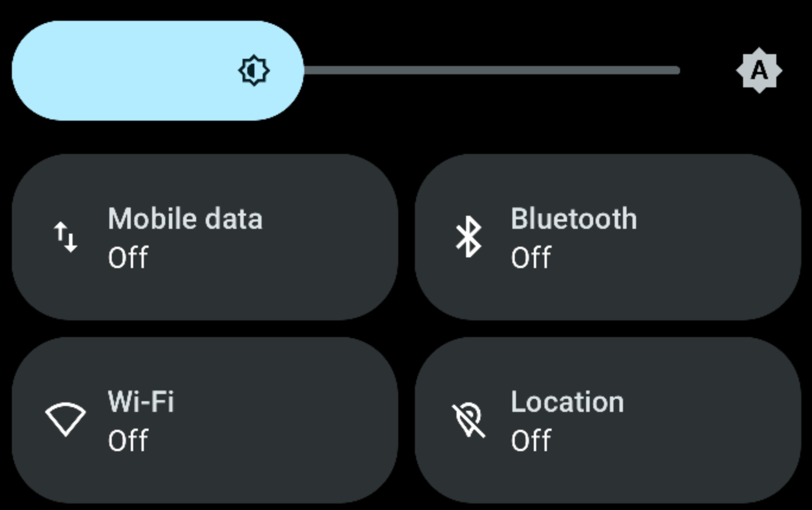
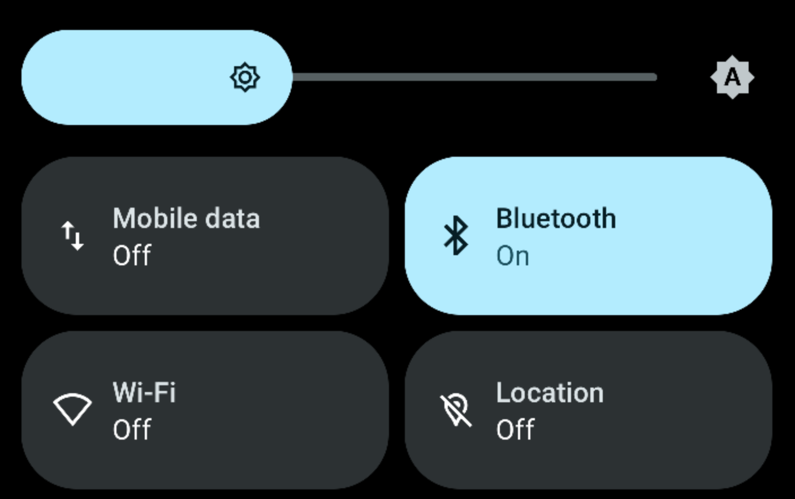

# BtQuickAccess

Starting with Android 14, enabling or disabling Bluetooth via the quick access menu requires two clicks.
I much prefered the "one click" UX, so I created this app, which restores the Android < 14 behavior.

The tile is designed to look and behave exactly like the system Bluetooth tile (see below screenshots).

## Screenshots

### Bluetooth enabled

### Bluetooth disabled

## Installation

Either build this repository via Android studio, or use a prebuilt APK from the [latest release](https://github.com/OneBlue/BtQuickAccess/releases/latest)

## Requirements

Root access is required for the tile to function (since Android doesn't let unprivileged apps toggle settings).

The `su` binary is expected to be in `$PATH`. This has been tested under Magisk v29.0.
